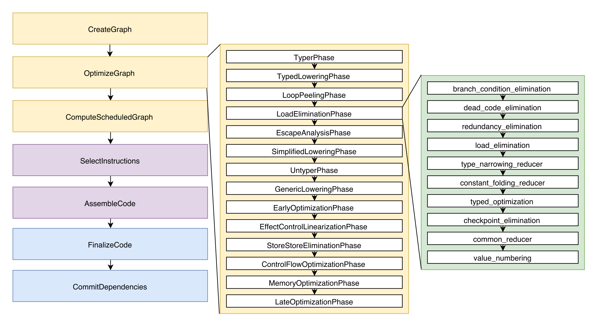

# JavaScript Engines
## Fuzzing
Target goal: _Detect unsound [runtime] behavior in the core constituents of JavaScript engines_

Fuzzers are often divided into two (2) categores, generative- or mutation-based; however, we'll approach the topic from a further abstracted perspective. We chose to break down a fuzzer, `Fz: X -> Y`, into the following broad functionalities:

- Explorability of `Y`-space (i.e., CFG/DFG)
- Exploitability of Unsoundness

From this perspective, we can both address the _direction_ and _form_ our fuzzer takes.

### Proposed Sample Transformations
- **Input**: Mutates parametric variables
- **Operation**: Mutates parametric operations
- **Insertion**: Insert newly generated IR
- **Concat**: Combine two existing programs
- **Splice**: Insert IR from part of another program
- **Type**: (Only if each CFG path is a **_type_**) Mutate blocks to improve probability of evaluating new type, using any of the above

### Minimizations
_WIP; Not a concern at this stage of research_

## Instrumentation
Options:
1. Hook fuzzer to standard binary (JS engine's parser responsible for syntax validation)
1. Hook fuzzer as a specific point, e.g., at the Interpreter (fuzzer responsible for syntax validation)
  - This could be expanded further to perform _high-targeted fuzzing_ against, e.g., only the JIT compiler

## JS Engines: Background
**Purpose:** To _parse_ and _execute_ JavaScript code

Modern engines will contain, _at least_, the to following components:
- Parser and bytecode compiler (JS -> IR)
- Interpreter
- \>=1 Just-in-Time (JIT) compiler(s)
- Runtime environment (VM)
- Garbage Collector (GC)

## JIT Optimizations

  

Vulnerabilities historically live in the _OptimizeGraph_ phase of the pipeline. Some optimizations:
- **Redundancy Elimination:** _"Failure to capture the side effects of an operation will lead to the removal of a typecheck
   and subsequently to a type confusion vulnerability."_

## To Answer
- Where do optimization occur the most?
- Which optimizations have the **worst** security history?

